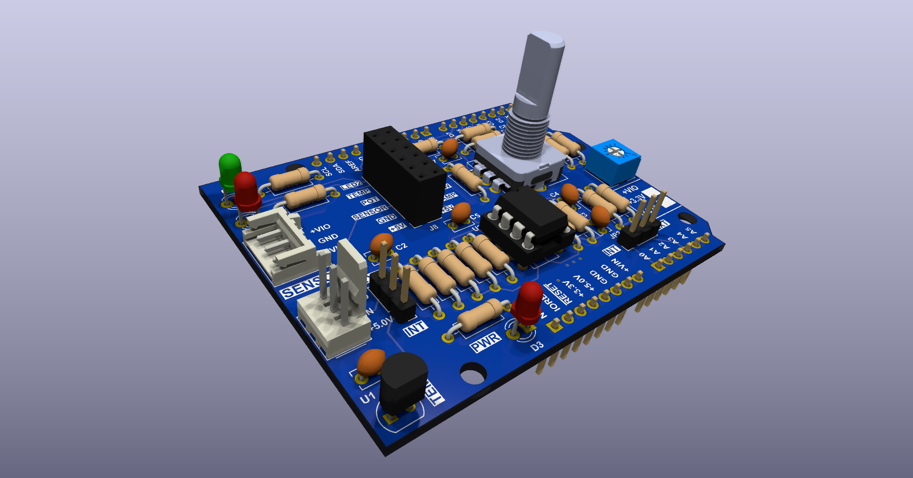

# Analog Shield

## Description

This repository has all CAD files for the Analog Shield board used in the University of Toronto, Department of Physic, "[Introduction to Electronics](https://plrs.physics.utoronto.ca/course-listing/) course." 

This board is used to train graduate students first and foremost in through hole solder techniques. As part of the training in the course they will as learn analog front end, digital IO design methods as well. Other than a teaching aid there is not intended practical use for this board.

The CAD program used to design this board is [KiCAD](https://www.kicad.org/) which open source and free to use. The [Interactive Html BoM](https://github.com/openscopeproject/InteractiveHtmlBom) plugin was used to generate the interactive bill of materials html file.

## Files

- Gerber Files are located in the [fabrication folder](./fabrication/)
- There is an [Interactive bill of materials html file](https://perc-sw.github.io/analog_shield/bom/ibom.html) that you can use to assist you in assembling the board. 
- PDF of [Schematic](./docs/pdf/analog_sheild_schematic.pdf)
- PDF of PCB
    - [Top layer Cu](./docs/pdf/board/analog_sheild_pcb_top.pdf)
    - [Inner 1 Cu](./docs/pdf/board/analog_sheild_pcb_inner_1.pdf)
    - [Inner 2 Cu](./docs/pdf/board/analog_sheild_pcb_inner_2.pdf)
    - [Bottom layer Cu](./docs/pdf/board/analog_sheild_pcb_bottom.pdf)
    